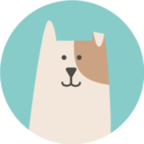
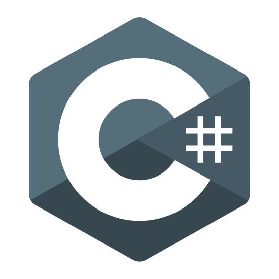
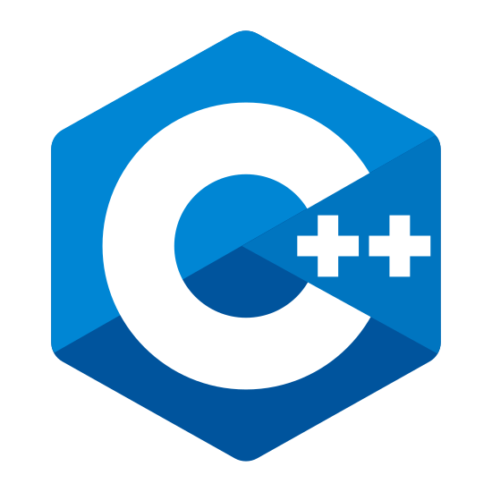

<h1>
<p align = "center">
  😃 Hello, I'm Aadi Poddar 
</p>
</h1>
<p align = "center">
  
</p>

<p align = center>
<a href="https://github.com/aadipoddar/">
  
</a>&nbsp;&nbsp;&nbsp;&nbsp;
<a href="https://aadi.vercel.app">
  
</a>&nbsp;&nbsp;&nbsp;&nbsp;
<a href="https://www.instagram.com/aadi__poddar/">
  
</a>&nbsp;&nbsp;&nbsp;&nbsp;
<a href="mailto:aadipoddarmail@gmail.com">
  
</a>&nbsp;&nbsp;&nbsp;&nbsp;
<a href="https://www.facebook.com/profile.php?id=100010877340723">
  
</a>&nbsp;&nbsp;&nbsp;&nbsp;
<br/>

***

## 🏢I'm is a full-stack developer based in India with a passion for building digital services/stuff. I'm currently studying in High School, Completing my engineering. Checkout my [Room](https://aadiroom.vercel.app).

***

### :octocat: <ins>Github:</ins>
<br/>
<p align = "left">
  <a href = "https://github.com/aadipoddar">
    
  </a>
</p>

***

### 🔧 <ins>Languages and Tools:</ins>
<br/>
<p>
&nbsp;&nbsp;&nbsp;&nbsp;&nbsp;&nbsp;
&nbsp;&nbsp;&nbsp;&nbsp;
&nbsp;&nbsp;&nbsp;&nbsp;
&nbsp;&nbsp;&nbsp;&nbsp;
&nbsp;&nbsp;&nbsp;&nbsp;
&nbsp;&nbsp;&nbsp;&nbsp;
&nbsp;&nbsp;&nbsp;&nbsp;
&nbsp;&nbsp;&nbsp;&nbsp;
&nbsp;&nbsp;&nbsp;&nbsp;
&nbsp;&nbsp;&nbsp;&nbsp;
</p>

<p align = "left">
  <br/>
  &nbsp;&nbsp;&nbsp;&nbsp;&nbsp;&nbsp;<a href = "https://github.com/aadipoddar">
    
  </a>
</p>

***

### ✨ <ins>Favourite Projects:</ins>
<br/>
<a href = "https://github.com/aadipoddar/Hazel">
  
</a>
<br/>
<a href = "https://github.com/aadipoddar/Primal">
  
</a>
<br/>
<a href = "https://github.com/aadipoddar/WhatsAppAndroidStudio">
  
</a>

***

### :thought_balloon: <ins>Random quote:</ins>

```
War. War never changes.

-Fallout narrator
```
